# 🌍 Travio: The Hyperscalable Multi-Modal Travel SaaS Platform


> **"Netflix for Travel Ticketing"** — A FAANG-grade, distributed system designed to handle the extreme concurrency of holiday ticket launches for Buses, Trains, Ferries, and Airlines.

---

## 📖 Table of Contents
1.  [Executive Summary](#-executive-summary)
2.  [The Engineering Challenge](#-the-engineering-challenge)
3.  [System Architecture](#-system-architecture)
4.  [Core Workflows (Lifecycles)](#-core-workflows-lifecycles)
5.  [Service Deep-Dive](#-service-deep-dive)
6.  [Domain-Driven Design (SaaS)](#-domain-driven-design-saas)
7.  [Getting Started](#-getting-started)

---

## 🚀 Executive Summary

Travio is a multi-tenant B2B SaaS platform that enables travel operators to manage their fleets, routes, and ticketing operations. Unlike traditional monolithic booking systems, Travio is engineered as a **distributed system** from day one, capable of serving **10 million concurrent users** with zero downtime.

**Key Value Propositions:**
*   **Multi-Modal Engine**: Agnostic inventory management supporting any seat map configuration (Bus layouts, Flight decks, Train carriages).
*   **Flash-Sale Ready**: Built-in Virtual Waiting Rooms to throttle traffic during "Eid/Christmas/Holiday" ticket drops.
*   **True SaaS**: complete organization isolation, role-based access, and secure invite systems.

---

## ⚡ The Engineering Challenge

Building a ticketing system sounds simple until you face **high concurrency**. Travio solves three critical distributed system problems:

### 1. The "Double Booking" Problem
**Scenario**: Two users click "Buy" on Seat A1 at the exact same millisecond.
**Solution**: **Distributed Optimistic Locking**.
*   We use Redis `SETNX` with a TTL to acquire a temporary lock on the seat.
*   The inventory service enforces a "compare-and-swap" mechanism on the database level (ScyllaDB/Postgres) as a final gate.

### 2. The "Thundering Herd" Problem
**Scenario**: 500,000 users refresh the page at 8:00 AM for ticket launch.
**Solution**: **Virtual Waiting Room (Queue Service)**.
*   A stateless admission system (Lua scripts on Redis) issues cryptographically signed "Queue Tokens".
*   Only requests with a valid token are allowed to hit the heavy `Search` and `Order` services.

### 3. Distributed Transactions
**Scenario**: Payment succeeds, but the Ticket PDF generation fails.
**Solution**: **Saga Pattern & Outbox Pattern**.
*   We use an Orchestration Saga with `Order Service`.
*   Rollback actions (Compensating Transactions) are triggered if any step (Payment, Inventory, Fulfillment) fails.

---

## 🏗 System Architecture

Travio follows a **"Share-Nothing" Microservices Architecture**.

### Technology Stack
| Layer | Technology | Rationale |
| :--- | :--- | :--- |
| **Backend** | Go (Golang) 1.25 | Goroutines for high concurrency, low GC latency. |
| **Communication** | gRPC + Protobuf | 10x faster/smaller than JSON/REST. Strongly typed contracts. |
| **Security** | mTLS | Zero-Trust internal network. Every service verifies the other. |
| **Edge** | Custom API Gateway | Centralized Auth, Rate-Limiting, Circuit Breaking. |
| **Primary DB** | PostgreSQL | Reliability for Relational Data (Identity, Orders). |
| **High-Speed DB** | ScyllaDB | Single-millisecond writes for Inventory/Seats. |
| **Caching** | Redis Cluster | Distributed Locks, Session Storage, Rate Limit Counters. |
| **Async** | Kafka / RabbitMQ | Decoupling services for Email, PDF Gen, Auditing. |

---

## 🔄 Core Workflows (Lifecycles)

### 1. Vendor Lifecycle (B2B SaaS)
*How a Transport Operator (e.g., "GreenLine Bus") onboards and operates.*


### 2. Traveller Lifecycle (B2C Booking)
*The high-concurrency path optimized for speed.*

```mermaid
sequenceDiagram
    autonumber
    actor User as Traveller
    participant GW as API Gateway
    participant Q as Queue Service
    participant SRCH as Search Service
    participant INV as Inventory Service
    participant ORD as Order Service

    Note over User, Q: 🚦 Traffic Control
    User->>GW: Search Request
    GW->>Q: CheckAdmission(IP)
    alt High Load
        Q-->>User: 429 Precondition Required (Enqueue)
    else Admitted
        Q-->>User: 200 OK (Queue-Token)
    end

    Note over User, SRCH: 🔍 Discovery
    User->>GW: Search(From, To, Date)
    GW->>SRCH: Elasticsearch Query
    SRCH-->>User: Trips [ {Bus, Train...} ]

    Note over User, INV: 🔒 Seat Locking
    User->>GW: Select Seat A1
    GW->>INV: LockSeat(TripID, A1)
    INV->>INV: Redis SETNX (TTL=5m)
    INV-->>User: Locked

    Note over User, ORD: 💳 Checkout
    User->>GW: Create Order
    GW->>ORD: Order.Create(Saga Start)
    ORD-->>User: Payment Link
```



### 3. Ticketing Saga (Async Fulfillment)
*Ensuring eventual consistency across 5+ services.*

```mermaid
sequenceDiagram
    autonumber
    participant ORD as Order Service
    participant PAY as Payment Service
    participant KAFKA as Message Queue
    participant FUL as Fulfillment Service
    participant NOT as Notification Service

    Note over ORD, PAY: 💰 Payment Phase
    ORD->>PAY: Process()
    PAY-->>ORD: Success (TxID: 999)

    Note over ORD, KAFKA: 📨 Fulfillment Phase
    ORD->>KAFKA: Publish(OrderConfirmed)
    
    par Parallel Processing
        KAFKA->>FUL: Consume(OrderConfirmed)
        FUL->>FUL: Generate PDF (Puppeteer)
        FUL->>FUL: Upload S3
        
        KAFKA->>NOT: Consume(OrderConfirmed)
        NOT->>NOT: Render Email Template
    end

    Note over FUL, NOT: 📦 Delivery
    FUL->>NOT: SendTicketLink(URL)
    NOT->>User: Email (Ticket Attachment)
```



---

## � Service Deep-Dive

| Service | Responsibility | Technical Highlight |
| :--- | :--- | :--- |
| **Gateway** | Traffic Control | Implements **JWT Injection** and **Circuit Breakers (Gobreaker)**. |
| **Identity** | Auth & SaaS | Uses **Bcrypt** for hashing and **PASETO/JWT** for tokens. Handles Org Invites. |
| **Inventory** | State Mgmt | **Optimistic Locking** on Redis to handle seat races. |
| **Pricing** | Logic Engine | Uses **Google CEL (Common Expression Language)** for dynamic rules (e.g., "If Rain, +10%"). |
| **Fulfillment** | Artifacts | **Stateless Workers** that generate PDFs and upload to S3. |
| **Search** | Discovery | **Elasticsearch** syncs via CDC (Change Data Capture) patterns. |
| **Fraud** | Security | Analyzes IP velocity and device fingerprinting. |
| **Audit** | Compliance | **Write-Only** logs for legal compliance. |

---

## 📦 Domain-Driven Design (SaaS)

We strictly follow DDD principles.
*   **Aggregates**: `Organization`, `Trip`, `Order`.
*   **Bounded Contexts**: `Identity` knows nothing about `Trips`. `Inventory` knows nothing about `User Names`.
*   **Anti-Corruption Layer**: The Gateway acts as an ACL, translating externally facing REST to internal gRPC.

---

## 🏁 Getting Started

### Prerequisites
*   Docker & Docker Compose
*   Go 1.25+
*   Make

### Installation
1.  **Clone & Env**:
    ```bash
    git clone https://github.com/MuhibNayem/Travio.git
    cd Travio
    cp .env.sample .env
    ```

2.  **Infrastructure Up**:
    ```bash
    docker-compose up -d scylla postgres redis kafka
    ```

3.  **Run Services**:
    ```bash
    # Run from project root
    docker compose up --build -d
    ```

    > **Note**: This will spin up 20+ containers (Postgres, ScyllaDB, Redis, Kafka, and Microservices). Ensure you have at least 8GB RAM available.

4.  **Explore**:
    *   API Docs: `http://localhost:8080/docs`
    *   Grafana: `http://localhost:3000`

---

Copyright © 2026 Travio Engineering. Built for scale.