# 🚌 Travio: Hyperscalable B2B Bus Ticketing Platform

> **Status**: Production-Grade Refactor  
> **Architecture**: Event-Driven Microservices  
> **Scale Target**: 10M+ Concurrent Users (FAANG-Ready)

Travio is a next-generation SaaS platform designed for intercity bus operators and travellers. Built with a "Share-Nothing" architecture, it leverages modern distributed systems patterns (CQRS, Sagas, Virtual Waiting Rooms) to handle massive traffic spikes during holiday seasons while providing a seamless B2B experience for bus operators.

---

## 🏗️ Architecture & Tech Stack

The system is composed of **16+ independent microservices** communicating via **gRPC (mTLS)** internally and exposed via a unified **API Gateway**.

| Component | Technology | Purpose |
| :--- | :--- | :--- |
| **Language** | Go 1.25 | High-performance, concurrent backend services |
| **Communication** | gRPC (Protobuf) | Low-latency inter-service communication |
| **Database** | ScyllaDB + PostgreSQL | Hybrid storage: Scylla for high-throughput (Inventory), Postgres for relational data (Identity) |
| **Caching** | Redis Cluster | Distributed locking, session management, and read-through caching |
| **Messaging** | Apache Kafka / RabbitMQ | Async fulfillment, logging, and notifications |
| **Search** | Elasticsearch | Full-text search for trips and stations |
| **API Gateway** | Custom Go Gateway | Rate limiting, Auth injection, Circuit Breakers |
| **DevOps** | Docker Compose | Container orchestration for local development |

---

## 🧩 Service Catalog

| Service | Responsibility | Key Features |
| :--- | :--- | :--- |
| **`gateway`** | Entry Point | JWT Validation, Rate Limiting, Circuit Breakers, Request Routing |
| **`identity`** | Auth & SaaS | **SaaS Role Management**, Organization Invites, JWT/PASETO issuance |
| **`operator`** | Vendor Ops | Fleet management, Bus configuration, Staff allocation |
| **`catalog`** | Trip Data | Route definitions, Schedule management, Read-Optimized data |
| **`search`** | Discovery | High-performance trip searching with filters |
| **`inventory`** | Seat Mgmt | **Optimistic Locking**, Redis-based seat maps, High concurrency |
| **`queue`** | Traffic Control | **Virtual Waiting Room**, Fair queuing during ticket drops |
| **`pricing`** | Dynamic Pricing | Rules engine (CEL) for real-time fare adjustments |
| **`order`** | Transactions | **Saga Orchestration**, Idempotent order creation |
| **`payment`** | processing | Integration with Payment Gateways, Reconciliation checking |
| **`fulfillment`** | Delivery | **Async Ticket Generation**, PDF creation, S3 Uploads |
| **`notification`** | Messaging | Email/SMS delivery, Template engine, Rate limiting |
| **`fraud`** | Security | Risk analysis engine for transactions |
| **`reporting`** | Analytics | Data aggregation for vendor dashboards |
| **`audit`** | Compliance | Immutable audit logs for sensitive actions |
| **`subscription`** | Billing | Vendor subscription plan management |

---

## 🔄 Core Workflow Lifecycles

### 1. Vendor Lifecycle (SaaS Operations)
The B2B flow where bus operators onboard, invite staff, and set up their fleet.


### 2. Traveller Lifecycle (Booking Journey)
The consumer flow designed for high concurrency (e.g., locking seats).


### 3. Ticketing Lifecycle (Async Saga)
The backend processing flow guaranteeing data consistency across services.

```mermaid
sequenceDiagram
    autonumber
    participant ORD as Order Service
    participant PAY as Payment Service
    participant FUL as Fulfillment Service
    participant NOT as Notification Service

    Note over ORD, PAY: 1. Payment Processing
    ORD->>PAY: ProcessPayment(OrderID, Amount)
    PAY-->>ORD: Payment Success (TxID: tx_999)
    ORD->>ORD: Update Status: CONFIRMED

    Note over ORD, FUL: 2. Async Fulfillment (Kafka)
    ORD->>FUL: Publish Event (OrderConfirmed)
    FUL->>FUL: PDF Generation Service
    FUL->>FUL: Upload to S3 (Secure Link)
    FUL->>ORD: Update Order (TicketURL)

    Note over FUL, NOT: 3. Delivery
    FUL->>NOT: SendTicket(Email, Link)
    NOT->>NOT: Render Template
    NOT->>User: 📧 Email Sent
```



---

## 🚀 Scalability Features

### Virtual Waiting Room (Queue Service)
- **Problem**: 100k users hitting the site at once for Eid tickets.
- **Solution**: A stateless, token-based waiting room.
- **Mechanism**:
    1.  Gateway checks `Queue-Token` header.
    2.  If missing/invalid, redirects to Waiting Room HTML.
    3.  `queue-service` issues JWTs with `nbf` (not before) claims throttling entry rate.

### Optimistic Inventory Locking
- **Problem**: "Double Booking" seats.
- **Solution**: Redis-based persistent locks.
- **Mechanism**:
    - `SET resource_lock:{tripID}:{seatID} {userID} NX EX 300`
    - Atomic execution ensures only one user holds the seat.

### Idempotency
- **Problem**: User double-clicks "Pay".
- **Solution**: `Idempotency-Key` header stored in Redis.
- **Mechanism**: Subsequent requests with the same key return the *cached response* immediately without re-processing payment.

---

## 🛠️ Setup & Deployment

### Prerequisites
- **Docker & Docker Compose**
- **Go 1.25+**
- **Make**

### Quick Start
1.  **Clone the repository**
2.  **Environment Setup**
    ```bash
    cp .env.sample .env
    # Adjust secrets as needed
    ```
3.  **Bootstrap Databases**
    ```bash
    docker-compose up -d scylla postgres redis
    go run scripts/init-db.go
    ```
4.  **Run Services**
    ```bash
    docker-compose up -d
    ```
5.  **Access**
    - API Gateway: `http://localhost:8080`
    - Swagger UI: `http://localhost:8080/swagger`

---

## 🔒 Security

- **mTLS**: implemented for all inter-service gRPC calls.
- **Role-Based Access Control (RBAC)**: Enforced at Gateway with `Identity` verification.
- **Secure Invites**: Cryptographically secure tokens for Org invitation flow.
- **Audit Logging**: Critical actions are immutable logged to `audit-service`.

---

> Built with ❤️ by the Travio Engineering Team.