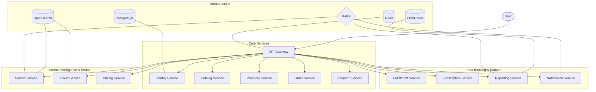

# System Architecture

## Overview
Travio is built using a **Cloud-Native Microservices Architecture**. All services communicate via **gRPC** for internal requests and export a public-facing **REST API** through a centralized Gateway.

## Service Map

## Data Consistency
- **Transactional Data:** PostgreSQL (OLTP)
- **Analytical Data:** ClickHouse (OLAP)
- **Real-time Search:** OpenSearch
- **Caching:** Redis 
- **Event Bus:** Kafka (Pub/Sub)
