# 🌐 Travio API Gateway

> **The Unified Entry Point for the Travio Distributed Architecture.**
> *Resilient, Scalable, and Observable.*


The **Travio API Gateway** is the critical edge component that orchestrates client requests to the backend microservices ecosystem. It is designed to be the "shield" of the infrastructure, implementing strict resiliency patterns like Circuit Breaking, Rate Limiting, and Timeouts to prevent cascading failures and ensure high availability under load.

---

## 🏗 Architecture

The Gateway acts as a reverse proxy and aggregator. It exposes RESTful HTTP endpoints to clients (Web, Mobile) and communicates with internal services via highly efficient gRPC channels.

```mermaid
graph TD
    Client[📱/💻 Client] -->|HTTP/1.1| Gateway[🛡️ API Gateway]
    
    subgraph "Resiliency Layer"
        Gateway -- "Rate Limit (Redis)" --> Redis[Redis Cache]
        Gateway -- "Circuit Breaker" --> Downstream
    end
    
    subgraph "Downstream Services"
        Downstream --> Identity[🆔 Identity Service]
        Downstream --> Catalog[🚆 Catalog Service]
        Downstream --> Inventory[🎫 Inventory Service]
        Downstream --> Order[📦 Order Service]
    end

    Identity -.-> PostgreSQL[(Postgres)]
    Catalog -.-> PostgreSQL
    Inventory -.-> PostgreSQL
    Order -.-> PostgreSQL
```



---

## 🚀 Key Features

### 🛡️ 1. Advanced Resiliency (Circuit Breakers)
We utilize the **Circuit Breaker** pattern (via `sony/gobreaker`) to prevent catastrophic cascading failures. If a downstream service hangs or fails, the Gateway fails fast, preserving its own resources.

- **Thresholds**: 
  - **Trip Condition**: > 5 consecutive failures or > 60% failure rate.
  - **Open State Timeout**: 60 seconds (Service is considered dead).
  - **Half-Open**: Allows 1 trial request to probe service health.
- **Coverage**: All downstream gRPC clients (`Catalog`, `Inventory`, `Order`) and the HTTP `Identity` proxy.

### 🚦 2. Distributed Rate Limiting
To protect against DDoS attacks and "Thundering Herd" scenarios, we implement a **Token Bucket** algorithm backed by Redis.

- **Global Limit**: Configurable (e.g., 100 requests/minute per IP).
- **Storage**: Redis (Atomic counters with expiration).
- **Headers**: Exposes `X-RateLimit-Limit`, `X-RateLimit-Remaining`, and `Retry-After`.

### 🔄 3. Protocol Translation (HTTP ↔ gRPC)
The Gateway handles the impedance mismatch between external JSON/HTTP REST clients and internal Protobuf/gRPC services.
- **Request**: Validates JSON body, extracts headers (Auth, Idempotency).
- **Response**: Marshals complex Protobuf structures into clean, consumeable JSON.

### 🔐 4. Authentication Proxy
Serves as a transparent proxy for `Identity` service authentication flows (`/auth/*`), managing secure communication channels while offloading complex business logic to the dedicated Identity domain.

---

## 🛠️ Technology Stack

- **Language**: Go (Golang) 1.25+
- **Framework**: `chi` (Lightweight, idiomatic router)
- **RPC**: gRPC + Protobuf
- **Resilience**: `sony/gobreaker`
- **Caching/Limiting**: Redis
- **Logger**: `slog` (Structured Logging)

---

## ⚡ Getting Started

### Prerequisites
- **Go**: v1.25 or higher
- **Redis**: Running on `localhost:6379` (Identity) and `6380` (Queue/Gateway)
- **Downstream Services**: Catalog, Inventory, Order, Identity must be running.

### Installation

```bash
# Clone the repository
git clone https://github.com/MuhibNayem/Travio.git

# Navigate to Gateway
cd server/services/gateway

# Install dependencies
go mod tidy
```

### Running Locally

```bash
# Start the server (Defaults to Port 8080)
go run cmd/main.go
```

### Environment Variables
| Variable | Default | Description |
| :--- | :--- | :--- |
| `PORT` | `8080` | HTTP Server Port |
| `REDIS_URL` | `localhost:6380` | Redis connection string for Rate Limiting |
| `IDENTITY_URL` | `http://localhost:8081` | URL for Identity Service (HTTP) |
| `CATALOG_URL` | `localhost:50051` | gRPC address for Catalog Service |
| `INVENTORY_URL` | `localhost:50052` | gRPC address for Inventory Service |
| `ORDER_URL` | `localhost:50053` | gRPC address for Order Service |

---

## 🧪 Testing & Verification

### Unit Tests
Run standard Go tests:
```bash
go test -v ./...
```

### Resiliency Load Test (Chaos Engineering)
We have included a dedicated load testing script to verify the Circuit Breaker behavior under stress.

**Scenario**: Simulate a failing downstream service and observe the circuit breaker "trip" to `Open` state.

```bash
# 1. Start the Gateway
go run cmd/main.go

# 2. In another terminal, run the load test
go run load_test/load.go
```

**Expected Output**:
```text
🚀 Starting Gateway Resiliency Load Test...
Target: http://localhost:8080/v1/auth/login
...
[200]: 45 requests
[503]: 55 requests
   -> Circuit Breaker ACTIVATED (Service Unavailable)
✅ Load Test Completed
```

---

## 📂 Project Structure

```bash
server/services/gateway
├── cmd
│   └── main.go                 # Application Entry Point
├── config
│   └── config.go               # 12-Factor App Configuration
├── internal
│   ├── client                  # Raw gRPC Client Factories
│   ├── handler                 # HTTP Handlers (Controller Layer)
│   │   ├── catalog.go          # Catalog Endpoints (gRPC wrapper)
│   │   ├── inventory.go        # Inventory Endpoints (gRPC wrapper)
│   │   └── order.go            # Order Endpoints (gRPC wrapper)
│   └── middleware              # Cross-Cutting Concerns
│       ├── circuit_breaker.go  # Resilience Logic
│       ├── cors.go             # Security Headers
│       └── rate_limit.go       # Access Control
├── load_test
│   └── load.go                 # Chaos/Stress Testing Tool
└── go.mod                      # Dependencies
```

---

## 🤝 Contributing

1.  Follow the **Go Standard Project Layout**.
2.  Ensure strict parity between HTTP Handlers and underlying gRPC services.
3.  **Always** wrap new external calls in a Circuit Breaker.
4.  Run `go fmt ./...` before committing.

---

> Built with ❤️ by the Travio Engineering Team.
